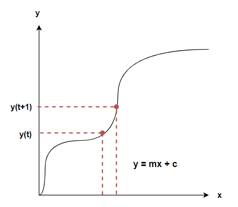
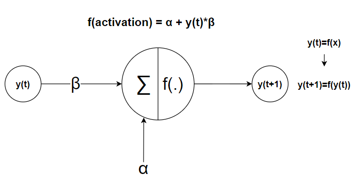
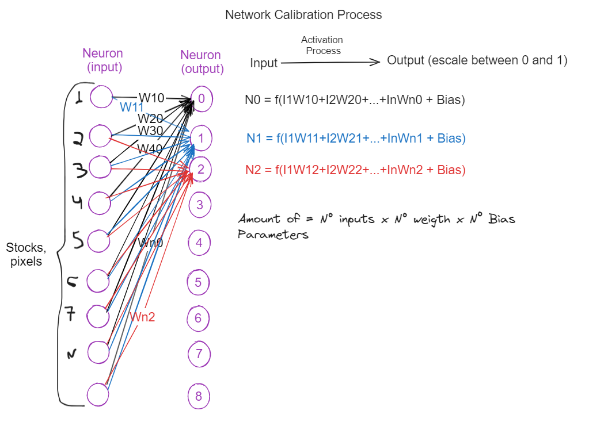
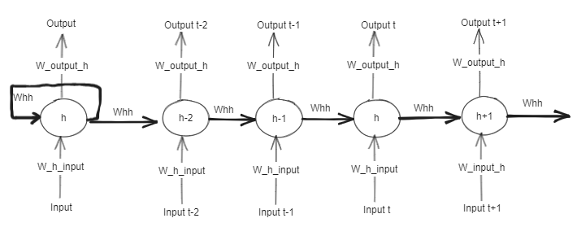

# LSTM - Long Short Term Memory 

This repository explore the concepts about LSTM

## Overview:

O LSTM (Long Short Term Memory) is a type of archtype used in Dee

  

### Equations in LSTM

### Equations base

$$y(t) = f(x)$$

$$\alpha$$

$$y_t =f(\sum_{i=1}^d (y_t*\beta)+\alpha_i)$$

$$f_{(activation)}(y_t) =\alpha+(y_t*\beta)$$

#### [1] Forgate Gate:

$$f_t=f_g(W_f*x_t+U_f*h_{(t-1)}+b_f)$$

#### [2] Input Gate:

$$i_t=f_g(W_i*x_t+U_i*h_{(t-1)}+b_i)$$

#### [3] Ouput Gate:

$$o_t=f_g(W_o*x_t+U_o*h_{(t-1)}+b_o)$$

#### [4] Cell Unit:

$$c_t=f_c(W_c*x_t+U_c*h_{(t-1)}+b_c)$$

#### [5] Cell State Vector:

$$c_t = f_t~\circ~c_{t-1}+i_t~\circ~\hat{c}_t$$

$$h_t = o_t~\circ~fh(c_t)$$

### Linear Regression

### Association between Linear Regression and Perceptron

### Process of Calibration

### LSTM

